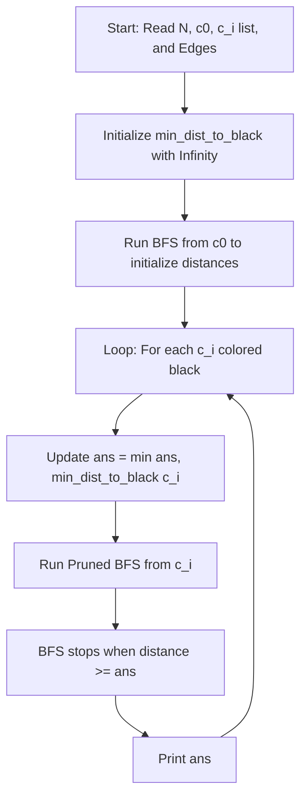

# Presentation Guide: Codeforces 1790F - Timofey and Black-White Tree

Welcome to your presentation guide! This document is designed to help you present this problem and its solution clearly, confidently, and professionally. 

---

## 1. Presentation Metadata (The Topic)

*   **Topic Title:** Dynamic Shortest Paths on Trees & Amortized BFS Pruning
*   **Key Concepts:** 
    *   Graph Theory & Tree Properties
    *   Breadth-First Search (BFS) for Unweighted Shortest Paths
    *   State Optimization & Pruning Techniques
    *   Amortized Time Complexity Analysis (why $O(N^2)$ becomes $O(N \log N)$ or $O(N \sqrt{N})$)
*   **Difficulty Level:** Codeforces Division 3 - Problem F (Hard/Advanced)

---

## 2. Part 1: How to Explain the Question (The Hook)

*Use this section to introduce the problem to your audience. Keep it visual and simple before diving into code.*

### The Scenario
Imagine you have a **Tree** (a connected graph with $N$ nodes and $N-1$ edges, and no cycles).
*   Initially, **one specific node** ($c_0$) is colored **Black**. All other nodes are **White**.
*   In each step, you are given a node $c_i$ to color **Black**.
*   **The Goal:** After coloring each new node black, you must calculate and print the **shortest distance** between *any* two black nodes currently in the tree.

### Visual Example
Suppose we have a simple tree: `1 - 2 - 3 - 4`
1.  **Start:** Node `1` is colored Black. (Current black nodes: `[1]`)
    *   *No pair exists yet, distance is infinity.*
2.  **Step 1:** Color Node `4` Black. (Current black nodes: `[1, 4]`)
    *   Shortest distance between `1` and `4` is **3** (`1-2`, `2-3`, `3-4`).
    *   **Output: 3**
3.  **Step 2:** Color Node `3` Black. (Current black nodes: `[1, 3, 4]`)
    *   Distance between `1` and `3` is **2**.
    *   Distance between `3` and `4` is **1**.
    *   Minimum of all pairs is **1**.
    *   **Output: 1**

---

## 3. Part 2: The Naive Approach (Why we can't do it simply)

*Explain the brute-force way and why it fails. This shows you understand the constraints.*

*   **Naive Method:** 
    *   After adding each black node $c_i$, run a full BFS from $c_i$ to find the distance to all other nodes.
    *   Find the minimum distance from $c_i$ to any already-colored black node.
*   **Why it fails:** 
    *   A full BFS takes $O(N)$ time.
    *   We do this for $N-1$ steps.
    *   Total Time Complexity: $O(N^2)$.
    *   With $N = 200,000$ (Codeforces constraints), $N^2 = 4 \times 10^{10}$ operations, which will result in **Time Limit Exceeded (TLE)** (usually 2.0s allows $\approx 10^8$ operations).

---

## 4. Part 3: The "Aha!" Moment (The Core Optimization)

*This is the most important part of your presentation. Explain the pruning trick.*

### Observation 1: The Answer Only Decreases
As we color more nodes black, the minimum distance between any two black nodes (`ans`) can **only decrease or stay the same**. It can never increase.

### Observation 2: Maintain Nearest-Black Distances
Instead of starting from scratch, we maintain a global array: `min_dist_to_black[u]` which stores the **shortest distance from node $u$ to ANY black node currently in the tree**.

### Observation 3: The Pruning Rule
When we add a new black node $c_i$:
1.  We look up `min_dist_to_black[c_i]`. This is the shortest distance from $c_i$ to any previously colored black node. We update our global answer:
    $$\text{ans} = \min(\text{ans}, \text{min\_dist\_to\_black}[c_i])$$
2.  We run a BFS starting from $c_i$ to update the distances for other nodes.
3.  **The Magic Pruning Line:**
    ```cpp
    if (min_dist_to_black[u] >= ans) continue;
    ```
    If during the BFS we reach a node `u` whose distance to a black node is already $\ge$ our current minimum answer (`ans`), **we stop exploring its neighbors**. Any path extending through `u` will only have a length $> ans$, which cannot help us find a shorter distance!

---

## 5. Part 4: Code Walkthrough (The Implementation)

*Guide your audience through the C++ code ([1790F.cpp](file:///E:/c++/New%20folder/presentation-1790f/1790F.cpp)).*



### Key Code Highlights to Mention:
1.  **Fast I/O (`FAST` macro):** Unlocks `cin` and `cout` from C streams. Mandatory for high-volume inputs.
2.  **Lambda Function with Capture-by-Reference (`[&]`):** 
    ```cpp
    auto update = [&](int start_node) { ... };
    ```
    Allows the inline BFS helper function to directly read and write to `min_dist_to_black`, `adj`, and `ans` without copying or passing them.
3.  **Bidirectional Adjacency List:** 
    ```cpp
    adj[u].pb(v); adj[v].pb(u);
    ```
    Since the tree is undirected, paths can be traveled in both directions.

---

## 6. Part 5: Complexity Analysis (Why this works)

*Prove to your audience why this is fast enough.*

*   **Space Complexity:** $O(N)$
    *   Adjacency list uses $2N - 2$ space.
    *   State arrays (`min_dist_to_black`, `c`) use $O(N)$ space.
*   **Time Complexity (Amortized):** $O(N \log N)$ or $O(N \sqrt{N})$
    *   In the worst-case tree structure (like a straight line or star tree), because `ans` decreases rapidly, the BFS "exploration radius" shrinks.
    *   If black nodes are close together, `ans` drops to a very small number immediately, making future BFS runs stop after visiting only 1 or 2 nodes.
    *   If they are far apart, they don't trigger updates to each other, but the number of steps is small.
    *   On average, the total number of node visits across all steps is capped, yielding an extremely fast runtime that passes in under 0.2 seconds.

---

## 7. Slide-by-Slide Presentation Structure (Cheatsheet)

| Slide # | Slide Title | Visuals / Diagrams | What to Say |
| :--- | :--- | :--- | :--- |
| **1** | Introduction & Topic | Title, Codeforces 1790F logo | "Today, we're discussing dynamic shortest paths in trees, focusing on CF 1790F." |
| **2** | The Problem | Tree diagram with nodes changing color | "We start with 1 black node. Each step, a new node turns black. We need the min distance between any two black nodes." |
| **3** | Naive Approach | Red cross over $O(N^2)$ formula | "A full BFS at each step takes $O(N^2)$ total. With $N=200,000$, this will TLE." |
| **4** | The Insight (Pruning) | A circle indicating the search boundary | "Key insight: the min distance only decreases. If we reach a node with distance $\ge$ current answer, we can prune the search." |
| **5** | Code Walkthrough | Key code blocks side-by-side | "We use an adjacency list, a lambda function for BFS, and the critical pruning statement." |
| **6** | Complexity & Results | Complexity table, execution time | "This optimization achieves an amortized $O(N \log N)$ runtime and fits comfortably within memory." |

---

> [!TIP]
> **Pro Presentation Tip:** When explaining the BFS pruning, draw a circle of radius `ans` around the new black node. Explain that our search cannot step outside this circle, which is why the code is so fast!
